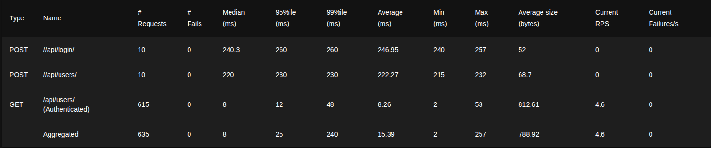
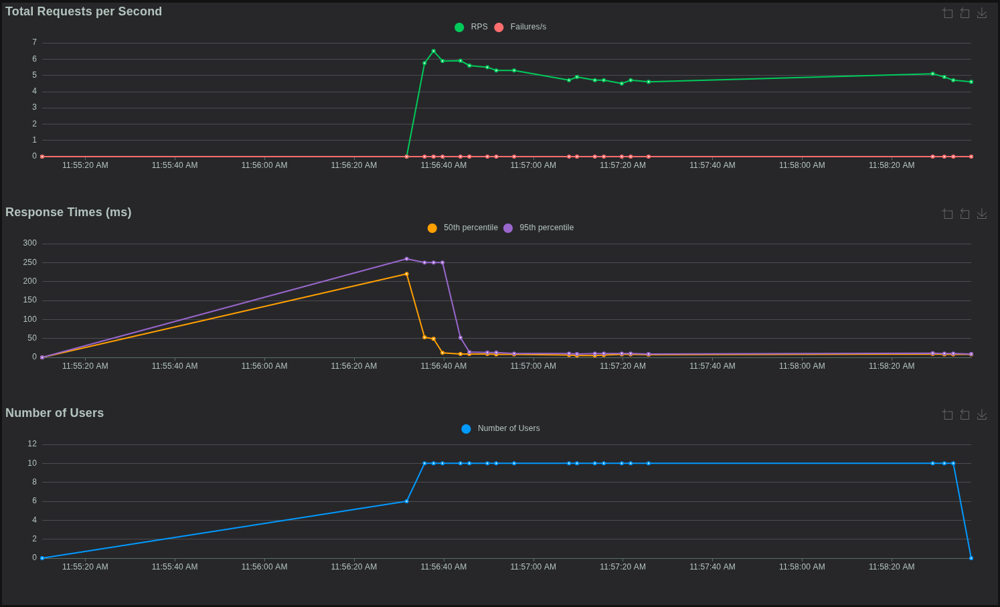
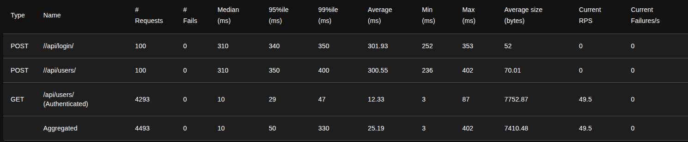
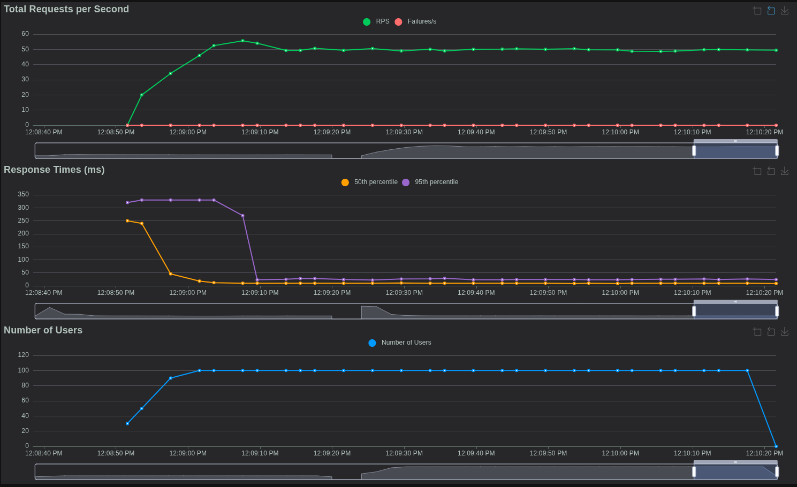
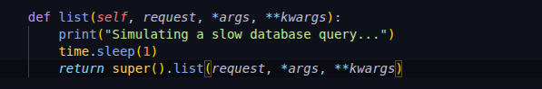
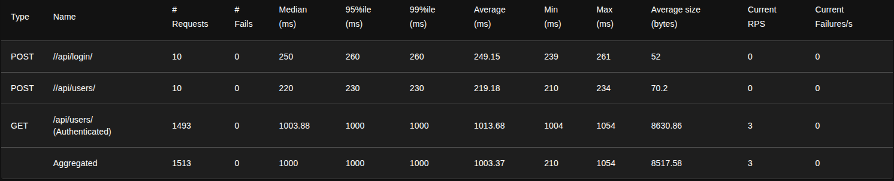
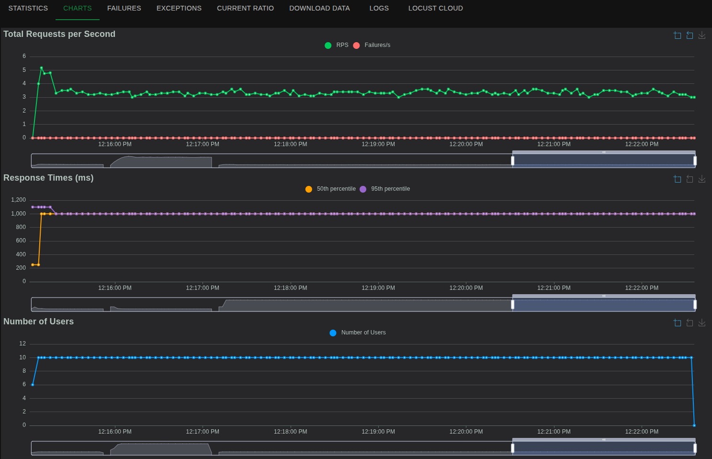

# Game Session Load Simulator

## 🚀 Introduction

This project simulates thousands of concurrent game players interacting with a backend API system to perform load testing and performance analysis. It includes a Django REST API backend with MySQL/Redis, load generation using Locust, and monitoring via Prometheus & Grafana. The entire system is containerized using Docker for easy deployment, mirroring workflows relevant to System Test Engineer roles like the one at EA.

## 🎯 Project Goal

* **Deliverable:** A distributed system to simulate player load against mock game APIs.
* **Outcome:** Demonstrate skills in backend development, load testing, monitoring, cloud deployment (AWS), and containerization (Docker) relevant to system testing roles.

---

## 🛠️ Core Technologies

* **Backend:** Python, Django, Django REST Framework, Gunicorn
* **Database & Caching:** MySQL, Redis
* **Load Testing:** Locust
* **Monitoring:** Prometheus, Grafana
* **Infrastructure & Deployment:** Docker, Docker Compose, AWS EC2, Nginx
* **Other:** Linux CLI, Git

---

## 🏗️ Architecture


┌──────────────────────────────┐
  │     Locust Load Clients      │
  │ (Simulate Players/Scenarios) │
  └──────────────┬───────────────┘
                 │
                 ▼
   ┌────────────────────────┐         ┌────────────┐
   │         Nginx          ├────────►│  Backend   │ (Django REST API)
   │ (Reverse Proxy / Port 80)│         │ Port 8000  │
   └────────────┬───────────┘         └─────┬──────┘
                │                           │
                │      ┌─────────────── ----┘
                │      │                    │
       ┌────────────┐  │  ┌────────────┐    │
       │   MySQL    │◄─┘  │   Redis    │◄───┘
       │ Persistent │     │  Caching   │
       │  Storage   │     │   Layer    │
       └────────────┘     └────────────┘
                │
                ▼ (Metrics Collection)
   ┌─────────────────────┐
   │     Prometheus      │
   │ (Scrapes Locust Exp.)│
   └────────────┬────────┘
                │
                ▼ (Data Visualization)
   ┌─────────────────────┐
   │  Grafana Dashboard  │
   │ (RPS, Latency, etc.)│
   └─────────────────────┘

---

## ✨ Features

* **Mock Backend API:** Django REST API providing endpoints (`/api/users/`, `/api/login/`, `/api/game/inventory/`) simulating player actions.
* **Authentication:** Token-based authentication for protected endpoints.
* **Data Storage:** MySQL for persistent user and inventory data.
* **Caching:** Redis for caching inventory data to improve read performance.
* **Load Simulation:** Locust script (`load_tests/locustfile.py`) defining user behavior (register, login, interact with inventory).
* **Live Monitoring:** Prometheus scrapes custom metrics from Locust; Grafana provides dashboards for visualization.
* **Containerized Deployment:** Docker and Docker Compose manage all services for easy setup and deployment.

---

## ⚙️ Setup & Installation

### Prerequisites

* Docker ([Install Guide](https://docs.docker.com/engine/install/))
* Docker Compose ([Install Guide](https://docs.docker.com/compose/install/))
* Git

### Local Development & Full Stack Test

1.  **Clone the repository:**
    ```bash
    git clone [https://github.com/rahul-240505/game-session-load-simulator.git](https://github.com/rahul-240505/game-session-load-simulator.git)
    cd game-session-load-simulator
    ```
2.  **Build and Run:** This command builds the necessary images and starts all services (backend, db, redis, nginx, locust, prometheus, grafana) locally.
    ```bash
    docker compose up -d --build
    ```
3.  **Access Services:**
    * Backend (via Nginx): `http://localhost:80/`
    * Locust UI: `http://localhost:8089`
    * Grafana: `http://localhost:3000` (admin/admin)
    * Prometheus: `http://localhost:9090`

### Cloud Deployment (Backend on EC2, Testers Local)

1.  **Provision EC2 Instance:** Launch an AWS EC2 instance (e.g., `t3.micro` with Ubuntu). Ensure the Security Group allows inbound traffic on ports `22` (SSH), `80` (HTTP for Nginx), and `8000` (Direct Backend Access for Testing - optional).
2.  **Install Docker & Git on EC2:**
    ```bash
    # Update packages
    sudo apt update && sudo apt upgrade -y
    # Install Git
    sudo apt install git -y
    # Install Docker & Docker Compose (Follow official Docker install steps)
    # Add user to docker group
    sudo usermod -aG docker ubuntu
    # Log out and log back in for group change to take effect
    ```
3.  **Clone Repo on EC2:**
    ```bash
    git clone [https://github.com/rahul-240505/game-session-load-simulator.git](https://github.com/rahul-240505/game-session-load-simulator.git)
    cd game-session-load-simulator
    ```
4.  **Modify `docker-compose.yml` for Server:** Edit the `docker-compose.yml` on the server to **only include** the `backend`, `db`, `redis`, and `nginx` services. Remove `locust`, `prometheus`, `grafana`.
5.  **Apply Backend Fixes:**
    * Add `gunicorn` to `backend/requirements.txt`.
    * Create `backend/start-backend.sh` script (includes `nc` wait, `migrate`, `gunicorn` start).
    * Add `netcat-traditional` and `curl` to the root `Dockerfile`'s `apt-get install` line.
    * Change `ALLOWED_HOSTS` in `backend/api/settings.py` to `['*']`.
    * Update the `backend` service `command` in `docker-compose.yml` to use `start-backend.sh` and add the `healthcheck`.
6.  **Launch Server Stack:**
    ```bash
    docker compose up -d --build backend db redis nginx
    ```
7.  **Run Testers Locally:**
    * Create `docker-compose.local.yml` on your local machine (containing only `locust`, `prometheus`, `grafana`). **Crucially, update the Locust `command` host to your EC2 instance's Public IP.**
    * Run: `docker compose -f docker-compose.local.yml up -d --build locust`
    * Access local tools: Locust (`localhost:8089`), Grafana (`localhost:3000`), Prometheus (`localhost:9090`).

---

## 📊 Usage

1.  **Start Load Test:** Access the Locust Web UI (`http://localhost:8089` if running locally, or `http://<EC2_IP>:8089` if running full stack on EC2). Enter the number of users and spawn rate, then click "Start Swarming".
2.  **Monitor in Grafana:** Access the Grafana UI (`http://localhost:3000`).
    * Log in (`admin`/`admin`).
    * Configure Prometheus as a data source (URL: `http://prometheus:9090`).
    * Import dashboard ID `14125` via grafana.com, selecting your Prometheus source.
    * Observe RPS, latency, failures, etc., on the dashboard.

---

## 📈 Performance Analysis & Results

*(Keep the excellent analysis section you already wrote! Include the text descriptions and embed the images using markdown: ``)*

### Test A: Initial Performance Baseline
> **Setup:** ...
> **Result:** ...



### Test B: High-Load Stress Test
> **Setup:** ...
> **Result:** ...



### Test C: Bottleneck Simulation & Analysis
> **Setup:** ...

> **Result:** ...



---

## 📄 Resume Impact

This project demonstrates practical experience in:
* Backend API Development (Django REST Framework)
* Database Management (MySQL) & Caching (Redis)
* Distributed Load Testing (Locust)
* Performance Monitoring & Visualization (Prometheus, Grafana)
* Containerization (Docker, Docker Compose)
* Cloud Deployment (AWS EC2)
* System Analysis & Debugging

---

##🔮 Future Improvements (Optional)

* Integrate Redis caching more deeply.
* Add more complex Locust user scenarios (trading, different player types).
* Implement backend monitoring (e.g., using `django-prometheus`).
* Set up HTTPS using Certbot/Let's Encrypt with Nginx.
* Automate deployment using CI/CD pipelines.